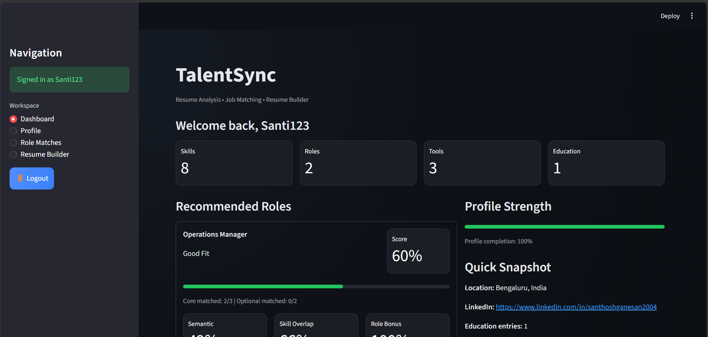
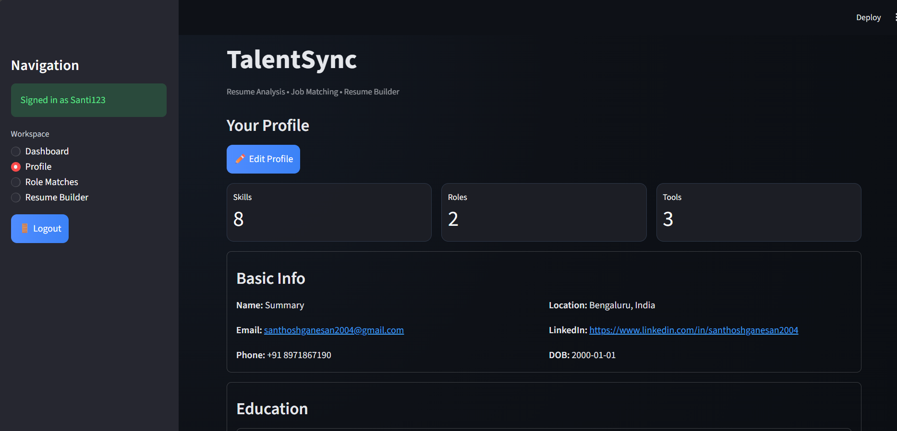
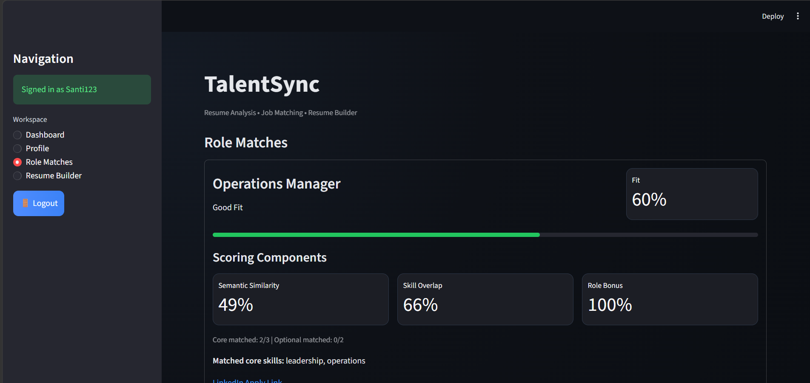
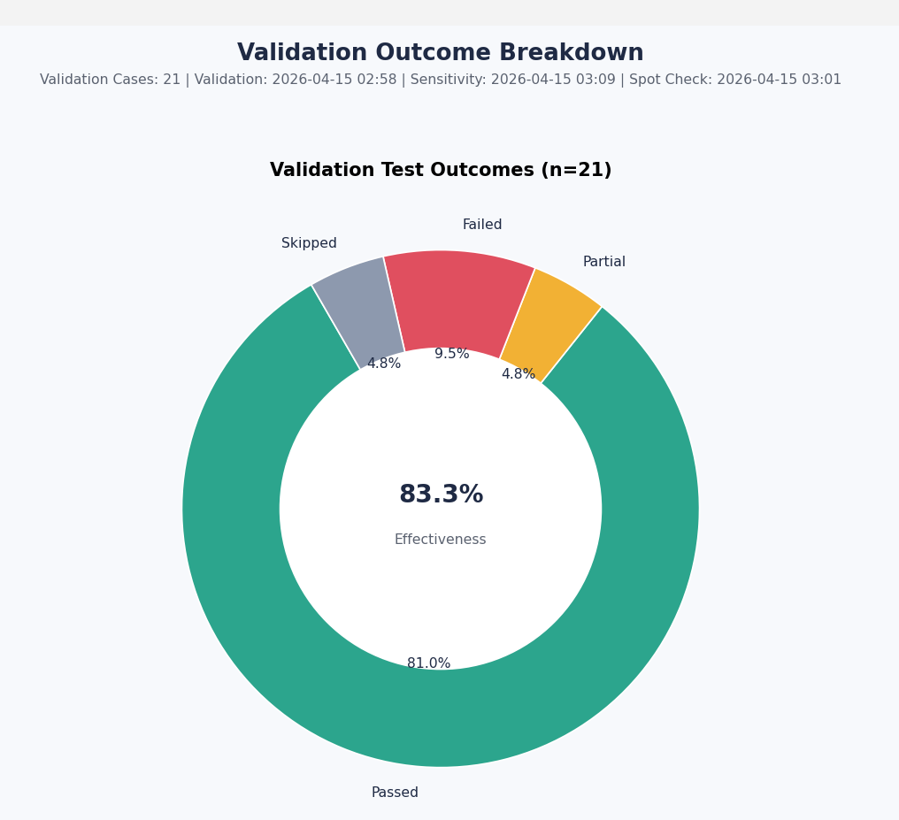

# TalentSync

TalentSync is a modern Streamlit-powered career intelligence portal that transforms unstructured resumes into actionable career insights. It combines resume parsing, role recommendation, and military-to-civilian skill translation in a single workflow to help job seekers discover the best-fit career paths quickly and confidently.

## What TalentSync does

TalentSync turns unstructured resumes into actionable career guidance. This app is built to:

- extract skills, roles, and tools from resumes
- convert military experience into civilian career language
- rank relevant job roles using hybrid semantic and overlap scoring
- generate resume-friendly profiles ready for hiring pipelines

## Why it stands out

This project is designed for users who want a smarter way to map experience to roles. It is especially useful for veterans and career transition candidates because the system interprets military terminology and matches it to real-world job titles.

## Key features

- **Streamlit UI** for resume upload and instant analysis
- **Document parsing** for PDF, DOCX, TXT, and image-based resumes
- **NER-driven extraction** for skills, roles, and tools
- **Military-to-civilian normalization** using curated mappings
- **Hybrid role matching** with semantic similarity + skill overlap
- **Role scoring dashboard** with clear fit labels and match details

## What the app looks like

### 1. Professional landing page


### 2. Profile builder view


### 3. Role recommendations with scoring breakdown


### 4. Validation and quality analytics


## How it works

1. Upload your resume to the portal.
2. The app extracts meaningful text from the document.
3. Skills, roles, and tools are automatically detected.
4. Military ranks and roles are normalized into civilian equivalents.
5. The system computes recommended roles and fit scores.
6. You can review the recommended job matches and build a resume.

## Run locally

```bash
cd "E:/Capstone Project"
pip install streamlit python-docx PyPDF2 pytesseract pillow sentence-transformers scikit-learn spacy PyMuPDF
python -m spacy download en_core_web_sm
streamlit run streamlit_app.py
```

Open the URL shown in the terminal (`http://localhost:8501` by default).

## Deploy publicly

If you want the portal to be accessible from anywhere, deploy it to a hosting service:

- **Streamlit Cloud**: connect the GitHub repo, select `master`, and set the main file to `streamlit_app.py`.
- **Heroku / Railway / other Python hosts**: use the same repo and ensure dependencies are installed.

In either case, the app will run the same Streamlit portal users already experience locally.

## Project structure

- `streamlit_app.py` — main user interface
- `text_extractor.py` — resume text extraction and OCR handling
- `skill_extractor.py` — entity extraction for skills, roles, tools
- `normalizer.py` — military language and rank normalization
- `role_matcher.py` — scoring engine for role recommendations
- `resume_generator.py` — resume builder from parsed profile data
- `role_profiles/` — role definitions and skill requirements
- `ner_resources/` — skill/role/tool vocabularies
- `military_mapping/` — military-to-civilian skill mappings

## Proof of work

The following screenshots document the project flow and analysis quality:

- Landing page and resume upload
- Profile builder with candidate details
- Role recommendation and scoring visualization
- Validation analytics from project testing

## Notes

- The repo is cleaned and focused on the Streamlit app experience.
- To make the portal publicly accessible, deploy it to Streamlit Cloud or another Python hosting platform.

---

TalentSync is a polished toolkit for resume-driven career insights and role matching.
